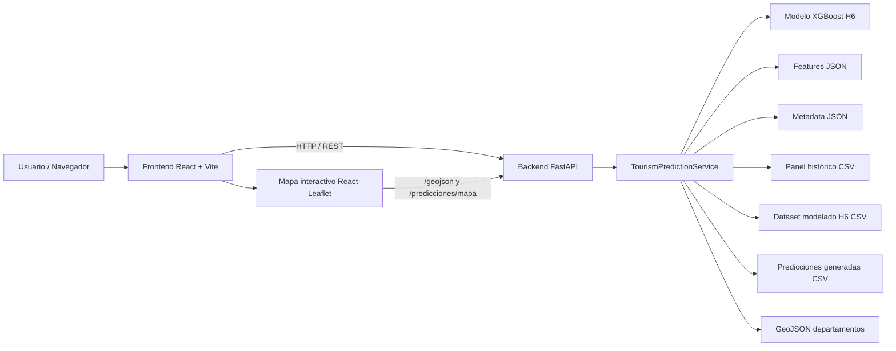
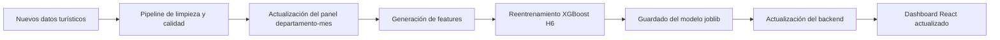
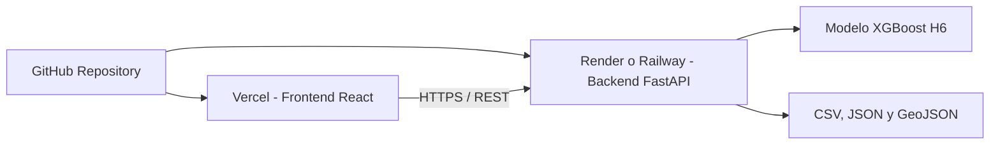

# Sistema de Predicción de Demanda Turística Departamental en Colombia

Sistema web para la predicción de demanda turística mensual de visitantes no residentes por departamento en Colombia, construido con un modelo de aprendizaje automático XGBoost, un backend en FastAPI y un frontend en React.

El sistema permite consultar predicciones por departamento, visualizar resultados en un mapa interactivo de Colombia, revisar métricas del modelo y consumir los servicios predictivos mediante una API REST.

---

## Tabla de contenido

1. [Descripción general](#descripción-general)
2. [Objetivo del proyecto](#objetivo-del-proyecto)
3. [Arquitectura del sistema](#arquitectura-del-sistema)
4. [Tecnologías utilizadas](#tecnologías-utilizadas)
5. [Estructura del repositorio](#estructura-del-repositorio)
6. [Modelo predictivo](#modelo-predictivo)
7. [Datos utilizados](#datos-utilizados)
8. [Métricas del modelo desplegado](#métricas-del-modelo-desplegado)
9. [API Backend](#api-backend)
10. [Frontend Web](#frontend-web)
11. [Ejecución local](#ejecución-local)
12. [Actualización de datos y modelo](#actualización-de-datos-y-modelo)
13. [Despliegue objetivo](#despliegue-objetivo)
14. [Estado actual del proyecto](#estado-actual-del-proyecto)
15. [Próximas mejoras](#próximas-mejoras)
16. [Consideraciones metodológicas](#consideraciones-metodológicas)
17. [Autores](#autores)

---

## Descripción general

Este proyecto implementa una solución de inteligencia artificial orientada a la predicción de demanda turística departamental en Colombia. La aplicación estima el número de visitantes no residentes para cada departamento utilizando datos históricos, variables exógenas y características temporales.

La solución está compuesta por tres capas principales:

- Frontend web desarrollado en React.
- Backend API desarrollado con FastAPI.
- Modelo predictivo XGBoost entrenado sobre un panel departamento-mes.

El sistema integra una visualización geográfica mediante un mapa interactivo de Colombia, en el cual cada departamento se colorea según la demanda turística pronosticada.

---

## Objetivo del proyecto

Desarrollar un sistema predictivo de demanda turística mensual por departamento en Colombia, basado en técnicas de machine learning y análisis de series temporales, que permita apoyar la toma de decisiones estratégicas en el sector turístico.

El sistema busca:

- Anticipar la demanda turística por departamento.
- Visualizar predicciones en un mapa interactivo.
- Comparar resultados mediante métricas de error.
- Facilitar la consulta de predicciones desde una interfaz web.
- Servir el modelo mediante una API REST reutilizable.
- Dejar una base técnica que pueda actualizarse con nuevos datos.

---

## Arquitectura del sistema

La aplicación sigue una arquitectura cliente-servidor.



### Flujo general

1. El usuario accede al dashboard web.
2. React consulta la API FastAPI.
3. FastAPI carga el modelo, los datos y el GeoJSON.
4. El servicio de predicción prepara las variables de entrada.
5. El modelo XGBoost genera la predicción.
6. La API devuelve el resultado en formato JSON.
7. El frontend renderiza el dashboard, el mapa y las métricas.

---

## Tecnologías utilizadas

### Backend

- Python
- FastAPI
- Uvicorn
- Pandas
- NumPy
- Scikit-learn
- XGBoost
- Joblib
- Pydantic

### Frontend

- React
- Vite
- Axios
- React-Leaflet
- Leaflet
- Recharts
- CSS moderno

### Datos y modelo

- CSV
- JSON
- GeoJSON
- Modelo serializado en formato `.joblib`

### Control de versiones

- Git
- GitHub

---

## Estructura del repositorio

```text
prediccion-demanda-turistica-colombia/
│
├── backend/
│   ├── app/
│   │   ├── api/
│   │   ├── core/
│   │   │   └── config.py
│   │   ├── schemas/
│   │   ├── services/
│   │   │   └── model_service.py
│   │   └── main.py
│   │
│   ├── data/
│   │   ├── 08_panel_modelo_turismo_2019_2025.csv
│   │   ├── 11_panel_features_base.csv
│   │   ├── 12_dataset_modelado_h6.csv
│   │   └── colombia_departamentos_normalizado.geojson
│   │
│   ├── models/
│   │   ├── xgboost_h6_model.joblib
│   │   ├── xgboost_h6_features.json
│   │   └── xgboost_h6_metadata.json
│   │
│   ├── outputs/
│   │   └── predicciones_xgboost_h6_generadas.csv
│   │
│   ├── scripts/
│   │   ├── 01_verificar_datos.py
│   │   └── 02_entrenar_modelo_xgboost_h6.py
│   │
│   └── requirements.txt
│
├── frontend/
│   ├── public/
│   ├── src/
│   │   ├── components/
│   │   │   └── TourismMap.jsx
│   │   ├── services/
│   │   │   └── api.js
│   │   ├── App.jsx
│   │   ├── App.css
│   │   ├── index.css
│   │   └── main.jsx
│   │
│   ├── package.json
│   ├── package-lock.json
│   ├── vite.config.js
│   └── .env
│
├── docs/
├── .gitignore
└── README.md
```

---

## Modelo predictivo

El modelo desplegado actualmente es:

```text
XGBoost Regressor - Horizonte 6 meses
```

El modelo estima la demanda futura de visitantes no residentes para cada departamento de Colombia usando una estructura de datos de tipo panel:

```text
departamento - mes
```

### Variable objetivo

La variable objetivo del modelo corresponde a la demanda turística futura:

```text
target
```

En el dataset de modelado H6, esta columna representa la demanda esperada a seis meses.

### Variables utilizadas

El modelo utiliza variables como:

- Visitantes no residentes históricos.
- Rezagos de demanda turística.
- Medias móviles.
- Variaciones porcentuales.
- Flujo aéreo nacional.
- Flujo aéreo internacional.
- Registro Nacional de Turismo.
- Capacidad hotelera.
- TRM.
- ISE.
- Variables calendario.
- Temporada alta, media y baja.
- Departamento codificado.
- Variables exógenas rezagadas.

### Artefactos del modelo

```text
backend/models/xgboost_h6_model.joblib
backend/models/xgboost_h6_features.json
backend/models/xgboost_h6_metadata.json
```

---

## Datos utilizados

El sistema utiliza datos oficiales y archivos procesados durante la fase de preparación de datos.

### Fuentes principales

- Visitantes no residentes.
- Registro Nacional de Turismo.
- Flujo aéreo nacional.
- Flujo aéreo internacional.
- Tasa Representativa del Mercado.
- Indicador de Seguimiento a la Economía.
- GeoJSON de departamentos de Colombia.

### Archivos principales

```text
08_panel_modelo_turismo_2019_2025.csv
11_panel_features_base.csv
12_dataset_modelado_h6.csv
colombia_departamentos_normalizado.geojson
```

### Unidad de análisis

```text
departamento-mes
```

Esta unidad permite integrar información turística, económica, aérea y territorial en una misma estructura analítica.

---

## Métricas del modelo desplegado

El modelo XGBoost H6 reentrenado para despliegue obtuvo las siguientes métricas en el conjunto de prueba:

| Métrica | Valor |
|---|---:|
| MAE | 300.68 |
| RMSE | 533.12 |
| MAPE | 48.16 % |
| wMAPE | 11.50 % |

La métrica priorizada es `wMAPE`, debido al fuerte desbalance territorial en la demanda turística. Departamentos como Bogotá, Antioquia y Bolívar tienen volúmenes de visitantes mucho mayores que departamentos de baja demanda, por lo que el error porcentual ponderado permite una lectura más representativa del desempeño global.

---

## API Backend

El backend está construido con FastAPI y expone servicios REST para consultar el modelo, los datos y las predicciones.

### URL local

```text
http://127.0.0.1:8000
```

### Documentación automática

```text
http://127.0.0.1:8000/docs
```

### Endpoints disponibles

| Método | Endpoint | Descripción |
|---|---|---|
| GET | `/` | Verifica que la API esté activa. |
| GET | `/health` | Devuelve el estado de carga del modelo, datos y GeoJSON. |
| GET | `/modelo/metadata` | Devuelve metadata y métricas del modelo. |
| GET | `/departamentos` | Lista los departamentos disponibles. |
| GET | `/geojson` | Devuelve el GeoJSON de departamentos de Colombia. |
| GET | `/predicciones` | Devuelve las predicciones generadas. |
| GET | `/predicciones/mapa` | Devuelve las predicciones para pintar el mapa. |
| GET | `/historico/{departamento}` | Devuelve la serie histórica de un departamento. |
| POST | `/predict/{departamento}` | Genera una predicción usando el modelo XGBoost. |

### Ejemplo de respuesta de predicción

```json
{
  "departamento": "ANTIOQUIA",
  "modelo": "XGBoost H6",
  "horizonte": "6 meses",
  "fecha_base": "2025-03-01",
  "fecha_predicha": "2025-09-01",
  "prediccion_visitantes": 13787.51,
  "descripcion": "Predicción estimada de visitantes no residentes para el departamento seleccionado."
}
```

---

## Frontend Web

El frontend está construido con React y Vite. Consume la API FastAPI mediante Axios.

### Funcionalidades principales

- Dashboard general del sistema.
- Tarjetas KPI del modelo.
- Consulta de predicción por departamento.
- Mapa interactivo de Colombia por departamentos.
- Colores según demanda pronosticada.
- Tooltip con información territorial.
- Ranking de departamentos con mayor demanda estimada.
- Métricas del modelo desplegado.

### URL local

```text
http://localhost:5173
```

---

## Ejecución local

### Requisitos previos

Tener instalado:

- Python 3.10 o superior.
- Node.js 18 o superior.
- npm.
- Git.

---

### 1. Clonar el repositorio

```bash
git clone https://github.com/eduar277/prediccion-demanda-turistica-colombia.git
cd prediccion-demanda-turistica-colombia
```

---

### 2. Configurar backend

Entrar a la carpeta del backend:

```bash
cd backend
```

Crear entorno virtual:

```bash
python -m venv .venv
```

Activar entorno virtual en Windows:

```bash
.venv\Scripts\activate
```

Instalar dependencias:

```bash
pip install -r requirements.txt
```

Verificar archivos de datos:

```bash
python scripts\01_verificar_datos.py
```

Entrenar nuevamente el modelo, si es necesario:

```bash
python scripts\02_entrenar_modelo_xgboost_h6.py
```

Levantar la API:

```bash
uvicorn app.main:app --reload
```

La API quedará disponible en:

```text
http://127.0.0.1:8000
```

---

### 3. Configurar frontend

Abrir otra terminal desde la raíz del proyecto:

```bash
cd frontend
```

Instalar dependencias:

```bash
npm install
```

Crear archivo `.env` dentro de la carpeta `frontend`:

```env
VITE_API_URL=http://127.0.0.1:8000
```

Ejecutar el frontend:

```bash
npm run dev
```

La aplicación quedará disponible en:

```text
http://localhost:5173
```

---

## Actualización de datos y modelo

El sistema está preparado para actualizar datos y generar nuevas predicciones siguiendo este flujo:



### Flujo técnico esperado

1. Incorporar nuevos archivos fuente.
2. Ejecutar pipeline de limpieza y transformación.
3. Actualizar el panel de modelado.
4. Regenerar el dataset H6.
5. Reentrenar el modelo XGBoost.
6. Guardar el modelo y su metadata.
7. Reiniciar el backend para cargar los nuevos artefactos.
8. Consultar las predicciones actualizadas desde el frontend.

---

## Despliegue objetivo

La arquitectura de despliegue recomendada es:



### Frontend

Plataforma recomendada:

```text
Vercel
```

Motivo:

- Integración directa con GitHub.
- Despliegue automático.
- Buen soporte para React y Vite.
- Configuración sencilla de variables de entorno.

### Backend

Plataformas recomendadas:

```text
Render
Railway
```

Motivo:

- Soporte para aplicaciones Python.
- Compatible con FastAPI.
- Permite configurar variables de entorno.
- Permite desplegar servicios web persistentes.

### Variable de entorno del frontend en producción

En Vercel se debe configurar:

```env
VITE_API_URL=https://url-del-backend-desplegado
```

---

## Estado actual del proyecto

El proyecto cuenta actualmente con:

- Backend FastAPI funcional.
- Modelo XGBoost H6 entrenado y guardado.
- API REST operativa.
- Frontend React conectado al backend.
- Dashboard visual con KPIs.
- Mapa interactivo por departamentos.
- Predicción individual por departamento.
- Repositorio versionado en GitHub.

---

## Próximas mejoras

Las siguientes mejoras están previstas para una versión posterior:

- Automatizar la actualización de datos desde fuentes oficiales.
- Incorporar autenticación para administración del sistema.
- Agregar carga controlada de nuevos archivos desde la interfaz.
- Implementar reentrenamiento desde backend.
- Agregar visualización de series históricas por departamento.
- Incorporar comparación de modelos en el dashboard.
- Agregar explicabilidad del modelo mediante importancia de variables.
- Desplegar backend y frontend en servicios cloud.
- Implementar monitoreo de drift de datos.
- Crear documentación técnica de API con ejemplos extendidos.

---

## Consideraciones metodológicas

El modelo fue entrenado respetando el orden temporal de los datos. No se utilizó partición aleatoria, ya que en problemas de series temporales esto puede generar fuga de información.

La evaluación se realizó usando datos no vistos en la fase de prueba, y se priorizó la métrica wMAPE debido al desbalance territorial de la demanda turística.

---

## Autores

Proyecto desarrollado para el curso IA para las Organizaciones.

Autores:

- Sergio Vergara Vega
- Eduar Ferney Rodríguez López
- Luis Mateo Méndez Pinzón
-   
Bogotá D.C., Colombia  
2026
